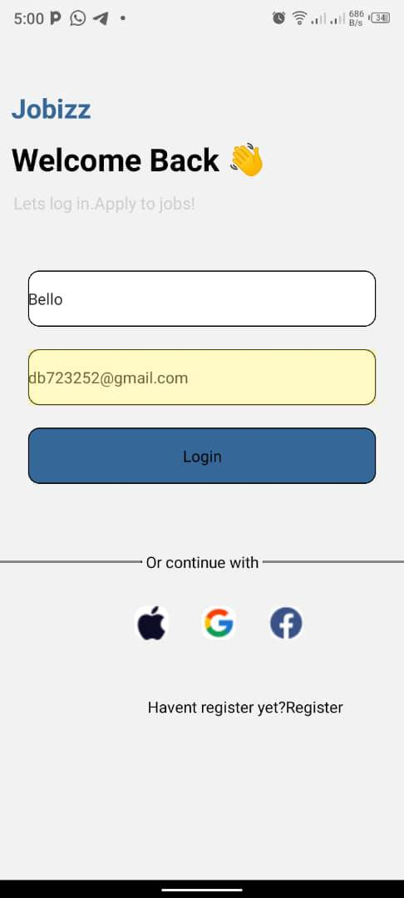
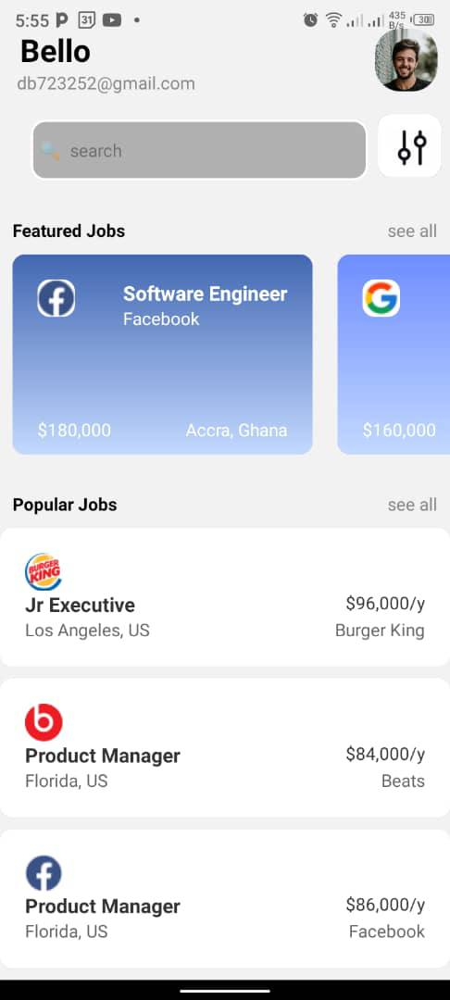

# rn-assignment-11150578

# Project Title

This project consists of two main components: Dashboard and Login.

# Dashboard

The Dashboard component is the main screen of the application. It displays a list of featured jobs and popular jobs. The user can search for jobs using the search bar at the top. The component also displays the user's name and email at the top right corner.

# Login

The Login component is the login screen of the application. It allows the user to enter their name and email to log in to the dashboard.

# ScreenShot

# Login Screenshot

# Dashboard Screenshot

